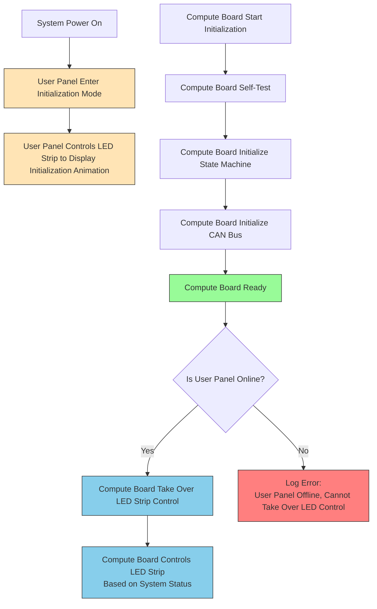
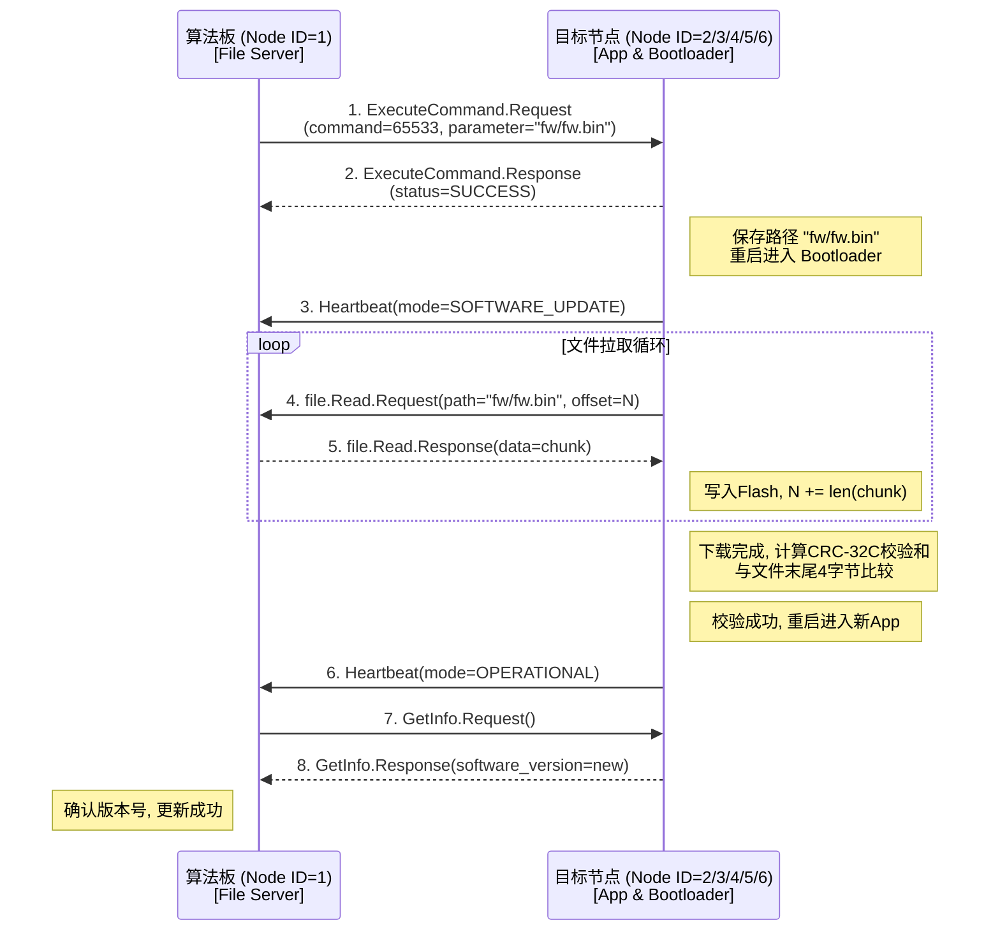

# ROBOTIC CAN Protocol

This document consists of three parts: 
1. [framework introduce](#ROBOTIC CAN Protocol Framework)
2. [message define](# ROBOTIC CAN Protocol Message )
3. [Cyphal_CAN demo example](# Let’s practice together)


# ROBOTIC CAN Protocol Framework

## 1. Introduction to Cyphal

Cyphal is an open, lightweight communication protocol designed for real-time distributed systems, particularly in aerospace, robotics, and automotive applications. Its decentralized architecture ensures robust communication even in mission-critical environments.

## 2. Core Concepts

### 2.1 Network Architecture

- **Decentralized peer network** with unique numeric node identifiers (node-IDs)
- Node-ID range: 0 to transport-specific upper boundary (≥127 guaranteed)
- Two communication paradigms:
  - **Message publication**: One-to-many publish/subscribe semantics
  - **Service invocation**: One-to-one request/response interactions (RPC-like)

### 2.2 Subjects and Services

| Concept      | Description                                          | Identifier                  |
| ------------ | ---------------------------------------------------- | --------------------------- |
| **Subjects** | Group message exchanges by semantic meaning          | Subject-ID (natural number) |
| **Services** | Group request/response exchanges by semantic meaning | Service-ID (natural number) |
| **Port-ID**  | Umbrella term for Subject-ID or Service-ID           | N/A                         |

### 2.3 Data Types

- Defined using **Data Structure Description Language (DSDL)**
- Specifies:
  - Name and version (major.minor)
  - Attributes
  - Optional fixed port-ID
- Service types define two inner data types: request and response

**Serialization**:

- DSDL generates serialization/deserialization code
- Guarantees constant memory footprint and computational complexity
- Transport layer handles frame decomposition and reassembly

### 2.4 Architectural Overview

```
┌─────────────────────────────────┐
│            Applications         │
├────────┬──────────────┬─────────┤
│ Required│  Standard   │ Custom  │
│functions│  functions  │functions│
├────────┴──────┬───────┴─────────┤
│ Required data │ Standard data   │
│    types      │    types        │
├───────────────┴─────────────────┤
│          Serialization          │
├─────────────────────────────────┤
│            Transport            │
└─────────────────────────────────┘
```

**Standard Functions**:

- Node health monitoring
- Node discovery
- Time synchronization
- Firmware updates
- Plug-and-play node support

## 3. Communication Mechanisms

### 3.1 Message Publication

Primary data exchange mechanism (sensor measurements, actuator commands).

**Properties**:

| Property       | Description                                     |
| -------------- | ----------------------------------------------- |
| Payload        | Serialized message object                       |
| Subject-ID     | Interpretation identifier                       |
| Source node-ID | Transmitter ID (excluded in anonymous messages) |
| Transfer-ID    | Used for sequencing and reassembly              |

**Anonymous Publication**:

- For nodes **without** assigned node-ID
- Enables plug-and-play functionality
- Excludes source node-ID

### 3.2 Service Invocation

Two-step exchange (configuration updates, firmware updates):

1. Client → Server: Service request
2. Server → Client: Response

**Properties**:

| Property       | Description                                 |
| -------------- | ------------------------------------------- |
| Payload        | Serialized request/response object          |
| Service-ID     | Service handling identifier                 |
| Client node-ID | Source (request), Destination (response)    |
| Server node-ID | Destination (request), Source (response)    |
| Transfer-ID    | Request/response matching and deduplication |

## 4. Transport Layer

### 4.1 Abstract Model

The transport layer facilitates exchange of serialized DSDL objects between nodes over a *transport network*.


**Transfer Types**:

| Type                 | Description                | Example                |
| -------------------- | -------------------------- | ---------------------- |
| **Message**          | Carry DSDL message objects | Sensor data broadcast  |
| **Service Request**  | Client → Server invocation | Configuration update   |
| **Service Response** | Server → Client reply      | Command acknowledgment |

### 4.2 Transfer Components

- **Payload**: Serialized DSDL objects with padding constraints
- **Metadata**: Encodes semantic and temporal properties
- **Frames**: Atomic entities carrying payload fragments

**Key Constraints**:

- **MTU (Maximum Transmission Unit)**: Maximum data per frame
- **Payload truncation**: Excessive data discarded after validation
- **Multi-frame transfers**: Used when payload exceeds single frame capacity

### 4.3 Transfer Priority

| Level       | Use Case                               | Precedence |
| ----------- | -------------------------------------- | ---------- |
| Exceptional | System failure scenarios               | Highest    |
| Immediate   | Strict latency constraints             |            |
| Fast        | High priority with latency constraints |            |
| High        | Important commands                     |            |
| Nominal     | Default (e.g., heartbeats)             |            |
| Low         | Non-critical data                      |            |
| Slow        | No time sensitivity                    |            |
| Optional    | Diagnostics/debug                      | Lowest     |

**Priority Rules**:

- Higher priority transfers preempt lower priority ones
- Service response priority matches request priority
- For same priority: Messages > Anonymous > Responses > Requests

### 4.4 Addressing

| Transfer Type     | Addressing Mode |
| ----------------- | --------------- |
| Message transfers | Broadcast only  |
| Service transfers | Unicast only    |

**Special Cases**:

- **Anonymous nodes**: No node-ID, single-frame messages only
- **Redundant transports**: Fault tolerance through multiple networks

### 4.5 Transfer-ID

Unsigned integer identifying transfers within a session, crucial for:

- Sequence monitoring
- Response matching
- Deduplication
- Multi-frame reassembly
- Redundant interface management

**Modes**:

- **Monotonic**: ≥2⁴⁸ distinct values (no overflow)
- **Cyclic**: Limited distinct values (overflows to zero)

```cpp
// Cyclic Transfer-ID difference calculation
std::uint8_t computeCyclicTransferIDDifference(
    std::uint8_t a, std::uint8_t b, std::uint8_t modulo)
{
    std::int16_t d = static_cast<std::int16_t>(a) - b;
    return (d < 0) ? d + modulo : d;
}
```

## 5. CAN Transport Specification

### 5.1 Capabilities

| Parameter                | Classic CAN                  | CAN FD    |
| ------------------------ | ---------------------------- | --------- |
| Max node-ID value        | 127                          | 127       |
| Transfer-ID modulo       | 32(bit 0-4 of the tail byte) | 32        |
| Priority levels          | 8                            | 8         |
| Max single-frame payload | 7 bytes                      | 63 bytes  |
| Anonymous transfers      | Supported                    | Supported |

> 💡 CAN FD is recommended as the primary transport protocol

### 5.2 CAN ID Structure


**Message Transfer Layout**:

```
28-26: Priority (3 bits)
25: Service not message (0)
24: Anonymous (1 bit)
23: Reserved (0)
22-21: Reserved (1)
20-8: Subject-ID (13 bits)
7: Reserved (0)
6-0: Source node-ID (7 bits)
```

**Service Transfer Layout**:

```
28-26: Priority (3 bits)
25: Service not message (1)
24: Request not response (1 bit)
23: Reserved (0)
22-14: Service-ID (9 bits)
13-7: Destination node-ID (7 bits)
6-0: Source node-ID (7 bits)
```

### 5.3 CAN Data Field

- Last byte = tail byte (metadata)
- Preceding bytes = transfer payload

**Tail Byte Structure**:

| Bit | Field             | Single-frame | Multi-frame           |
| --- | ----------------- | ------------ | --------------------- |
| 7   | Start of transfer | 1            | 1 (first), 0 (others) |
| 6   | End of transfer   | 1            | 1 (last), 0 (others)  |
| 5   | Toggle bit        | 1            | Alternates per frame  |
| 4-0 | Transfer-ID       | Modulo 32    | Modulo 32             |

**Key Features**:

- **Toggle bit**: Alternates state per frame for deduplication
- **Padding**: Only in last frame of multi-frame transfers
- **CRC**: CRC-16/CCITT-FALSE for multi-frame transfers


------


# ROBOTIC CAN Protocol Message 

## 1. Version Number

- v0.5

## 2. Communication Interface
- **CAN 2.0B, 29-bit ID**
- Baud rate: **1000 kbit/s**
- Recommended location of sample point: **75%~87.5%**

## 3. Terminology Explanation

- **Message publication** — The primary method of data exchange with one-to-many publish/subscribe semantics.
- **Service invocation** — The communication method for one-to-one request/response interactions
- Transfer priority level mnemonics per the recommendations given in the Cyphal Specification:

```c
Exceptional = 0,
Immediate = 1,
Fast = 2,
High = 3,
Nominal = 4,
Low = 5,
Slow = 6,
Optional = 7,
```

## 4. Node ID Definition [Source Node ID]
| Node Name                             | Node ID |
| :------------------------------------ | :------ |
| Compute Board (RK3588)                | 1       |
| Real-time Control Board (STM32H503)   | 2       |
| Left Motor (STM32G4SPIN)              | 3       |
| Right Motor (STM32G4SPIN)             | 4       |
| Mowing Motor (STM32G4SPIN)            | 5       |
| Height Adjustment Motor (STM32G4SPIN) | 6       |

## 5. General Message Definitions

### 5.1 Heartbeat [#7509]
- Message type: Message publication
- Message priority: High [3]
- Subject-ID: 7509
- Usage rules:
  - MAX_PUBLICATION_PERIOD = 1 second. The publication period shall not exceed this limit. The period should not change while the node is running.
  - OFFLINE_TIMEOUT = 3 seconds. If the last message from the node was received more than this amount of time ago, it should be considered offline.

```python
# The uptime seconds counter should never overflow. The counter will reach the upper limit in ~136 years, upon which time it should stay at 0xFFFFFFFF until the node is restarted. Other nodes may detect that a remote node has restarted when this value leaps backwards.
uint32_t uptime # [second]

# The abstract health status of this node.
uint8_t health
    # The component is functioning properly (nominal).
    NOMINAL = 0
    # A critical parameter went out of range or the component encountered a minor failure that does not prevent the subsystem from performing any of its real-time functions.
    ADVISORY = 1
    # The component encountered a major failure and is performing in a degraded mode or outside of its designed limitations.
    CAUTION = 2
    # The component suffered a fatal malfunction and is unable to perform its intended function.
    WARNING = 3

# The abstract operating mode of the publishing node. This field indicates the general level of readiness that can be further elaborated on a per-activity basis using various specialized interfaces.
uint8_t mode
    # Normal operating mode.
    OPERATIONAL = 0
    # Initialization is in progress; this mode is entered immediately after startup.
    INITIALIZATION = 1
    # E.g., calibration, self-test, etc.
    MAINTENANCE = 2
    # New software/firmware is being loaded or the bootloader is running.
    SOFTWARE_UPDATE = 3

# Optional, vendor-specific node status code, e.g. a fault code or a status bitmask. The default setting is 0
uint8_t vendor_specific_status_code
```

### 5.2 GetInfo [#430]

- Message type: Service invocation
- Message priority: Nominal [4]
- Service-ID: 430
- Request: NULL
- Response:

```python
# The Cyphal protocol version implemented on this node, both major and minor. Not to be changed while the node is running.
uint8 protocol_version_major
uint8 protocol_version_minor

# The version information shall not be changed while the node is running. The correct hardware version shall be reported at all times, excepting software-only nodes, in which case it should be set to zeros.
# If the node is equipped with a Cyphal-capable bootloader, the bootloader should report the software version of the installed application, if there is any; if no application is found, zeros should be reported.
uint8 hardware_version_major
uint8 hardware_version_minor
uint8 software_version_major
uint8 software_version_minor

# A version control system (VCS) revision number or hash. Not to be changed while the node is running.
# For example, this field can be used for reporting the short git commit hash of the current software revision. Set to zero if not used.
uint64 software_vcs_revision_id

# The unique-ID (UID) is a 96-bit long sequence that is likely to be globally unique per node.
# The vendor shall ensure that the probability of a collision with any other node UID globally is negligibly low.
# UID is defined once per hardware unit and should never be changed.
# All zeros is not a valid UID.
# If the node is equipped with a Cyphal-capable bootloader, the bootloader shall use the same UID.
uint8[12] unique_id

# Human-readable non-empty ASCII node name. An empty name is not permitted.
# The name shall not be changed while the node is running.
# Allowed characters are: a-z (lowercase ASCII letters) 0-9 (decimal digits) . (dot) - (dash) _ (underscore).
# Node name is a reversed Internet domain name (like Java packages), e.g. "com.manufacturer.project.product".
uint8[50] name
```

### 5.3 ExecuteCommand [#435]

- Message type: Service invocation
- Message priority: Nominal [4]
- Service-ID: 435
- Request:
```python
# Standard pre-defined commands are at the top of the range (defined below).
uint16 command
    # Reboot the node.
    COMMAND_RESTART = 65535
    # Shut down the node; further access will not be possible until the power is turned back on.
    COMMAND_POWER_OFF = 65534
    # Begin the software update process using uavcan.file.Read.
    COMMAND_BEGIN_SOFTWARE_UPDATE = 65533
    # Return the node's configuration back to the factory default settings (may require restart).
    COMMAND_FACTORY_RESET = 65532
    # Cease activities immediately, enter a safe state until restarted.
    COMMAND_EMERGENCY_STOP = 65531
    # This command instructs the node to store the current configuration parameter values and other persistent states to the non-volatile storage. 
    COMMAND_STORE_PERSISTENT_STATES = 65530
    # This command instructs the node to physically identify itself in some way--e.g., by flashing a light or emitting a sound.
    COMMAND_IDENTIFY = 65529
    # Start to charge
    COMMAND_CHARGE = 65528
    # Stop charging
    COMMAND_STOP_CHARGE = 65527
```
- Response:
```python
# The result of the request.
uint8 status
    STATUS_SUCCESS        = 0     # Started or executed successfully
    STATUS_FAILURE        = 1     # Could not start or the desired outcome could not be reached
    STATUS_NOT_AUTHORIZED = 2     # Denied due to lack of authorization
    STATUS_BAD_COMMAND    = 3     # The requested command is not known or not supported
    STATUS_BAD_PARAMETER  = 4     # The supplied parameter cannot be used with the selected command
    STATUS_BAD_STATE      = 5     # The current state of the node does not permit execution of this command
    STATUS_INTERNAL_ERROR = 6     # The operation should have succeeded but an unexpected failure occurred
```

## 6. Specific Message Definitions

### Message publication

#### Battery_Status [#5000]
- Message type: Message publication
- Message priority: Low [5]
- Subject-ID: 5000
- Usage rule: 10Hz
```python
# [C]: Pack mounted thermistor
float16 temperature_cells
# [C]: Battery CHG MOS
float16 temperature_chg
# [C]: Battery DSG MOS
float16 temperature_dsg
# [A]: Positive: defined as a discharge current. Negative: defined as a charging current
float32 current
# [V]: Battery voltage
float32 voltage
# [%]: The estimated state of charge, in percent remaining (0 - 100).
uint8 state_of_charge
# [Ah]: This is either the consumption since power-on or since the battery was full
float32 capacity_consumed
# Fault, health, readiness, and other status indications
uint32 status_flags
    See "Battery Status Flag Bit Definitions"
```

###### Battery Status Flag Bit Definitions
-  Bit definitions for the `status_flags` field in the `Battery_Status` message.
-  Value `0`: Not triggered/false, `1`: Triggered/true
-  `Reserve` indicates bits reserved for future use, can be rewritten.
-  `Warning` indicates a non-critical issue that may require attention.
-  `Error` indicates a critical issue that prevents normal operation, mower should be stopped.

| Status Flag                            | Bit Position | Description                                                                  |
| :------------------------------------- | :----------- | :--------------------------------------------------------------------------- |
| READY_TO_USE                           | 0            | The battery is ready to use. Should always be set if no faults are present.  |
| CHARGING                               | 1            | The battery is charging. Mutually exclusive with `DISCHARGING`.              |
| CELL_BALANCING                         | 2            | The battery is balancing cells. **Reserve**                                  |
| FAULT_CELL_IMBALANCE                   | 3            | Cell imbalance fault detected. **Reserve**                                   |
| DISCHARGING                            | 4            | The battery is discharging. Mutually exclusive with `CHARGING`.              |
| REQUIRES_SERVICE                       | 5            | The battery requires service. **Reserve**                                    |
| BAD_BATTERY                            | 6            | The battery is bad/locked. **Error**: The battery can't be used.             |
| PROTECTIONS_ENABLED                    | 7            | Protections are enabled. **Reserve**                                         |
| FAULT_PROTECTION_SYSTEM                | 8            | Protection system fault. **Reserve**                                         |
| FAULT_OVER_VOLT                        | 9            | Over-voltage fault detected. **Error**: The voltage is higher than `21.25V`. |
| FAULT_UNDER_VOLT                       | 10           | Under-voltage fault detected. **Error**: The voltage is lower than `13.5V`.  |
| FAULT_OVER_TEMP                        | 11           | Over-temperature fault detected. **Warning**: The battery can't charge.      |
| FAULT_UNDER_TEMP                       | 12           | Under-temperature fault detected. **Reserve**                                |
| FAULT_OVER_CURRENT                     | 13           | Over-current fault detected. `16A` continue for `1s`                         |
| FAULT_SHORT_CIRCUIT                    | 14           | Short circuit fault detected. Battery voltage is `0`/ too low.               |
| FAULT_INCOMPATIBLE_VOLTAGE             | 15           | Incompatible voltage fault detected. **Reserve**                             |
| FAULT_INCOMPATIBLE_FIRMWARE            | 16           | Incompatible firmware fault detected. **Reserve**                            |
| FAULT_INCOMPATIBLE_CELLS_CONFIGURATION | 17           | Incompatible cells configuration fault detected. **Reserve**                 |
| CAPACITY_RELATIVE_TO_FULL              | 18           | Battery is fully charged.  Capacity is relative to full.                     |


#### Motor_Status [#5001]
- Message type: Message publication
- Message priority: Low [5]
- Subject-ID: 5001
- Usage rule: 100Hz (Height adjustment only publish at this freq when running motor)
```python
# error_status. See "Motor Error Status Bit Definitions"
uint32 error_status
# [V] motor voltage (value: 198 means 19.8V)
int16 voltage
# [A] motor current (value: 1234 means 12.34A)
int16 current  
# [C] motor temperature (value: 234 means 23.4°C)
int16 motor_temp       
# Current value, with the same sign convention as setpoint: if set/query SPEED, unit rpm(-32768~32767); if set/query POSITION, unit ‰(-1000~1000)
int16 rpm_position
# Measured angle of connected angle sensor, in degrees. Range is -180 to 180. The angle increases as the
int16 motor_angle
# Reserved value.
int16 reserved
```
##### Motor Error Status Bit Definitions

| Macro Name       | Hex Value | Description                                           |
| :--------------- | :-------- | :---------------------------------------------------- |
| `MC_NO_ERROR`    | `0x0000`  | No error                                              |
| `MC_NO_FAULTS`   | `0x0000`  | No error                                              |
| `MC_DURATION`    | `0x0001`  | FOC execution rate too high                           |
| `MC_OVER_VOLT`   | `0x0002`  | Software over-voltage detection                       |
| `MC_UNDER_VOLT`  | `0x0004`  | Software under-voltage detection                      |
| `MC_OVER_TEMP`   | `0x0008`  | Software over-temperature detection                   |
| `MC_START_UP`    | `0x0010`  | Motor startup failure                                 |
| `MC_SPEED_FDBK`  | `0x0020`  | Speed feedback error                                  |
| `MC_OVER_CURR`   | `0x0040`  | Hardware over-current detection (emergency input)     |
| `MC_SW_ERROR`    | `0x0080`  | General software error                                |
| `MC_SAMPLEFAULT` | `0x0100`  | Insufficient phase current samples (<2 valid samples) |
| `MC_OVERCURR_SW` | `0x0200`  | Software over-current protection triggered            |
| `MC_DP_FAULT`    | `0x0400`  | Driver protection fault                               |
| `MC_STALL_FAULT` | `0x0800`  | Motor stall condition detected                        |
| `MC_MOS_FAULT`   | `0x1000`  | MOSFET check failure                                  |

#### RAIN_SENSOR_Status [#5002]

- Message type: Message publication
- Message priority: Nominal [4]
- Subject-ID: 5002
- Usage rule: 1Hz
```python
uint8 rain_sensor_status # '1' is triggerd(detected rain)
```

#### IO_SENSOR_Status [#5003]

- Message type: Message publication
- Message priority: Nominal [4]
- Subject-ID: 5003
- Usage rule: 20Hz
```python
uint8 io_sensor_status
    IO_INDEX_BUMP_L = 1 << 0
    IO_INDEX_BUMP_R = 1 << 1
    IO_INDEX_LIFT_L = 1 << 2
    IO_INDEX_LIFT_R = 1 << 3
    IO_CHARGER_DET  = 1 << 4 # hall sensor triggered or terminal rising edge from 0V -> >= +20V
```

### Huayi Motor Message Definition
#### Motor No.1 Feedback Data Packet [#96]
- Message type: Message publication
- Message priority: Low [5]
- Subject-ID: 96
- Usage rule: The sending period can be set through #82 service request, default 100ms.
```python
uint8 status # Driver status code
    0x00: Reset
    0x01: Disable (to render unable to function or use)
    0x02: Error (Fault)
    0x03: Idle
    0x04: Reinitialize 
    0x05: Execution completed 
    0x06: Save parameters 
    0x07: Restore Parameters
    0x08: Simulation device calibration (CAL) 
    0x09: Impedance Identification (RL-Id) 
    0x0A: Magnetic Flux Identification (Flux-Id) 
    0x0B: Hall Identification (Hall-Id) 
    0x0C: Encoder Identification (Enc-Id) 
    0x0D: Pole Pair Identification (PolePairs-Id) 
    0x0E: Force alignment (Align) 
    0x0F: Initial Positioning (IPD) 
    0x10: Preparation before operation (Prepare) 
    0x11: Load Identification (Load-Id) 
    0x21: Voltage Open-Loop Mode (Direct-Vs) 
    0x22: Torque-Current Mode 
    0x30: Profile-Position Mode 
    0x31: Profile-Velocity (Contour Speed Mode) 
    0x32: Position interpolation mode (Interp-Position) 
    0x33: Slow-Down (Slow-down)
uint16 error_status # Driver error status code
    Bit[0] Bus voltage is too low (DRV_UV) 
    Bit[1] Bus voltage is too high (DRV_OV) 
    Bit[2] Phase line overcurrent (DRV_OC) 
    Bit[3] Motor Overheating (MOTOR_OT) 
    Bit[4] Drive Over Temperature (DRV_OT) 
    Bit[5] EEPROM read error (EEP_FLT) 
    Bit[6] Hall sensor error (HALL_FLT) 
    Bit[7] Encoder error (ENC_FLT) 
    Bit[8] Speed control error (VELO_CTRL_FLT) 
    Bit[9] Position control error (POSI_CTRL_FLT) 
    Bit[10] External Trigger Error (EXT_FLT) 
    Bit[11] Startup Error (STARTUP_FLT) 
    Bit[12] Stall Fault (STALL_FLT) 
    Bits[14:13] Maintain 
    Bit[15] Is it a fatal error (FATAL)
```

#### Motor No.2 Feedback Data Packet [#97]
- Message type: Message publication
- Message priority: Low [5]
- Subject-ID: 97
- Usage rule: The sending period can be set through #82 service request, default will not send.
```python
int32 real_position # Real position, unit: cnt (encoder pulse count)
int32 real_speed # Real speed, unit: 0.1 RPM
```

#### Motor No.3 Feedback Data Packet [#98]
- Message type: Message publication
- Message priority: Low [5]
- Subject-ID: 98
- Usage rule: The sending period can be set through #82 service request, default will not send.
```python
# This data frame is used to provide feedback on the actual torque current of the motor, the temperature of the driver, and the temperature of the motor.
int32 real_torque_current # Real torque current, unit: mA
int16 drive_temperature # Driver temperature, unit: °C
int16 motor_temperature # Motor temperature, unit: °C
```

### Service invocation

#### MOTOR_COMMAND [#145]

- Message type: Service invocation
- Message priority: Nominal [4]
- Service-ID: 145
- Request:
```python
Uint8 mode
    STOP     = 0     # Shut all driver PWM output
    BRAKE    = 1     # Lock rotor still with D-Current Parameter
    SPEED    = 2     # For speed controlled motor. sign +/- for different direction.
    POSITION = 3     # For position controlled motor.
    SET_D_CURRENT = 4     # Set centripetal force, available on both brake and rotate.
    SET_Q_CURRENT = 5     # Set radial force, available on motor rotate.
    ACK_FAULTS = 6     # Clear Faults
int16 setpoint      # if set SPEED, unit rpm(-32768~32767); if set POSITION, unit ‰(-1000~1000)
```
- Response:
```python
uint8 status
    STATUS_SUCCESS = 0     # Started or executed successfully
    STATUS_FAILURE = 1     # Could not start or the desired outcome could not be reached
```

#### UI_LED_COMMAND [#146]
- Message type: Service invocation
- Message priority: Nominal [4]
- Service-ID: 146
- Request:
```python
uint16 led_cmd # Bit setting, 0 is off, 1 is on
    IO_LED_BTN_1 = 1 << 0
    IO_LED_BTN_2 = 1 << 1
    IO_LED_BTN_3 = 1 << 2
    IO_LED_BTN_4 = 1 << 3
    IO_LED_RTK   = 1 << 4
    IO_LED_GSM   = 1 << 5
    IO_LED_BLE   = 1 << 6
```
- Response:
```python
# The result of the request.
uint8 status
    STATUS_SUCCESS = 0     # Started or executed successfully
    STATUS_FAILURE = 1     # Could not start or the desired outcome could not be reached
```

#### UI_Ledstrip_COMMAND [#147]
- Flowchart


- Message type: Service invocation
- Message priority: Nominal [4]
- Service-ID: 147
- Request:
```c
typedef enum
{
    LED_STRIP_WORK_MODE_INITIALIZING        = 0, /* Initializing until the Compute board is ready */
    LED_STRIP_WORK_MODE_CHARGE              = 1,
    LED_STRIP_WORK_MODE_FULL_CHARGE         = 2,
    LED_STRIP_WORK_MODE_CUTTING             = 3,
    LED_STRIP_WORK_MODE_HOMING              = 4,
    LED_STRIP_WORK_MODE_STOP                = 5, /* IDLE */
    LED_STRIP_WORK_MODE_ERROR               = 6,
    LED_STRIP_WORK_MODE_OTA                 = 7,
    LED_STRIP_WORK_MODE_WARNING             = 8, /* such as lost rtk or gps signal weakness, mower won't stop */
    LED_STRIP_WORK_MODE_MAPPING             = 9,  /* in mapping mode, led strip breathing with blue color */
    LED_STRIP_WORK_MODE_MANUAL_CONTROL      = 10, /* in manual control mode, led strip steady white color */
    LED_STRIP_WORK_MODE_SHUTTING_DOWN       = 11,
}led_strip_work_mode_e; /* Means the state machine of the mower */

typedef struct
{
    uint8_t enable;      /* 0: Disable the led strip; 1: Enable the led strip */
    uint8_t show_number; /* Led strip display number of led */
    led_strip_work_mode_e mode;
}led_strip_cmd_t;

led_strip_cmd_t led_strip_cmd;
```
- Response:
```python
uint8 status
    STATUS_SUCCESS = 0     # Started or executed successfully
    STATUS_FAILURE = 1     # Could not start or the desired outcome could not be reached
```

- Led Strip Work Mode Description

| Work Mode      | Description                                                          | Behavior                                                            |
| :------------- | :------------------------------------------------------------------- | :------------------------------------------------------------------ |
| INITIALIZING   | Initializing until the Compute board is ready                        | **Pink** color, in a **100ms** continuous **Chaser Lights** cycle   |
| CHARGE         | Charging in dock                                                     | **Green breathing** light                                           |
| FULL_CHARGE    | Fully charged in dock                                                | **Green** light steady                                              |
| CUTTING        | Cutting                                                              | **Blue** light steady                                               |
| HOMING         | Returning to dock                                                    | **Yellow** light steady                                             |
| STOP           | Idle or after pressing stop button                                   | **Blue** color, in a **100ms** continuous **Chaser Lights** cycle   |
| ERROR          | Error state                                                          | **Red** light steady                                                |
| OTA            | Over-the-air FW update                                               | **Purple** color, in a **100ms** continuous **Chaser Lights** cycle |
| WARNING        | Warning state (e.g., lost RTK signal), mower won't stop running task | **Red breathing** light                                             |
| MAPPING        | Mapping mode                                                         | **Blue breathing** light                                            |
| MANUAL_CONTROL | Manual control mode                                                  | **White** light steady                                              |
| SHUTTING_DOWN  | Shutting down, compute board send cmd and shut down                  | **Red** color, in a **100ms** continuous **Chaser Lights** cycle    |


#### Button_Event_COMMAND [#148]

- Message type: Service invocation
- Message priority: High [3]
- Service-ID: 148
- Usage rule: This service request is initiated by the user panel (Client). Unicast automatically when button status on user panel changes
- Request:
```python
uint8 button # which button
    BTN_INDEX_POWER      = 0
    BTN_INDEX_START      = 1
    BTN_INDEX_HOME       = 2
    BTN_INDEX_CONFIRM    = 3
    BTN_INDEX_EMERG_STOP = 4
uint8 event
    BTN_EVENT_PRESS_UP         = 0
    BTN_EVENT_PRESS_DOWN       = 1
    BTN_EVENT_LONG_PRESS_START = 2
    BTN_EVENT_CLICK            = 3
```
- Response:
```python
uint8 status
    STATUS_SUCCESS = 0     # Started or executed successfully
    STATUS_FAILURE = 1     # Could not start or the desired outcome could not be reached
```

### Huayi Motor Service Definition
#### Set the driver [#80]
- Message type: Service invocation
- Message priority: Nominal [4]
- Service-ID: 80
- Request:
```python
uint8 set_driver
    0x01: Enable the driver 
    0x00: Disable the driver
```
- Response:
```python
uint8 status
    STATUS_SUCCESS = 0     # Started or executed successfully
    STATUS_FAILURE = 1     # Could not start or the desired outcome could not be reached
```

#### Clear errors [#81]
- Message type: Service invocation
- Message priority: Nominal [4]
- Service-ID: 81
- Request:
```python
uint8 param
    0xCC: clear errors
    other: No any operation
```
- Response:
```python
uint8 status
    STATUS_SUCCESS = 0     # Started or executed successfully
    STATUS_FAILURE = 1     # Could not start or the desired outcome could not be reached
```

#### Config feedback data packet [#82]
- Message type: Service invocation
- Message priority: Nominal [4]
- Service-ID: 82
- Request:
```python
# Config the sending cycle of 3 feedback data packets. default 100, unit: ms. When set to 0, the data packet will stop being sent.
uint8 period_1 
uint8 period_2
uint8 period_3
```
- Response:
```python
uint8 status
    STATUS_SUCCESS = 0     # Started or executed successfully
    STATUS_FAILURE = 1     # Could not start or the desired outcome could not be reached
```

#### Set the target value and motor mode [#83]
- Message type: Service invocation
- Message priority: Nominal [4]
- Service-ID: 83
- Request:
```python
# The definition of the target value is related to the working mode: In the contour speed mode, it is the target speed, unit: 0.1 RPM;
# in the contour position mode / position interpolation mode, it is the target position, unit: cnt(encoder pulse count); 
# in the voltage open-loop mode, it is the duty cycle of the output voltage, unit: 0.1% (for example: the number 100 indicates that the output voltage duty cycle is 10.0%); 
# in the torque mode, it is the percentage of the output torque, unit: 0.1% (for example: the number 100 indicates that the output torque is 10.0%).
int32 setpoint # the target value under the corresponding mode
uint8 mode
    0x21: Voltage open-loop mode
    0x22: Torque mode 
    0x30: Profile position mode
    0x31: Profile speed mode
    0x32: Position interpolation mode
uint8 Interpolation_period # Used only in position interpolation mode (other operation modes need to be set to 0), unit: ms.
uint8 Receiving_timeout # Unit: 10 ms. When set to 0, no reception timeout detection is performed.
```
- Response:
```python
uint8 status
    STATUS_SUCCESS = 0     # Started or executed successfully
    STATUS_FAILURE = 1     # Could not start or the desired outcome could not be reached
```

#### Set contour acceleration/deceleration [#84]
- Message type: Service invocation
- Message priority: Nominal [4]
- Service-ID: 84
- Request:
```python
uint32 contour_acceleration # The setting range is from 1 to 100000, unit: rpm/s.
uint32 contour_deceleration # The setting range is from 1 to 100000, unit: rpm/s.
```
- Response:
```python
uint8 status
    STATUS_SUCCESS = 0     # Started or executed successfully
    STATUS_FAILURE = 1     # Could not start or the desired outcome could not be reached
```

#### Set contour speed [#85]
- Message type: Service invocation
- Message priority: Nominal [4]
- Service-ID: 85
- Request:
```python
uint32 speed # The setting range is from 1 to 100000, unit: 0.1 rpm.
```
- Response:
```python
uint8 status
    STATUS_SUCCESS = 0     # Started or executed successfully
    STATUS_FAILURE = 1     # Could not start or the desired outcome could not be reached
```

#### Set the maximum output torque [#86]
- Message type: Service invocation
- Message priority: Nominal [4]
- Service-ID: 86
- Request:
```python
uint16 maximum_torque # The setting range is from 0 to 1000, representing a torque range of 0.0% to 100.0%. For example, if it is set to 805, it indicates that the maximum torque is 80.5%.
```
- Response:
```python
uint8 status
    STATUS_SUCCESS = 0     # Started or executed successfully
    STATUS_FAILURE = 1     # Could not start or the desired outcome could not be reached
```

#### Set the controller gain [#87]
- Message type: Service invocation
- Message priority: Nominal [4]
- Service-ID: 87
- Request:
```python
uint16 speed_controller_gain # The setting range is from 10 to 2000
uint16 position_controller_gain # The setting range is from 10 to 2000
```
- Response:
```python
uint8 status
    STATUS_SUCCESS = 0     # Started or executed successfully
    STATUS_FAILURE = 1     # Could not start or the desired outcome could not be reached
```

#### Set PID parameters of the speed loop [#88]
- Message type: Service invocation
- Message priority: Nominal [4]
- Service-ID: 88
- Request:
```python
uint16 P_gain # The setting range is from 0 to 1000
uint16 I_gain # The setting range is from 0 to 1000
uint16 D_gain # The setting range is from 0 to 1000
```
- Response:
```python
uint8 status
    STATUS_SUCCESS = 0     # Started or executed successfully
    STATUS_FAILURE = 1     # Could not start or the desired outcome could not be reached
```

#### Enter the engineering test mode [#94]
- Message type: Service invocation
- Message priority: Nominal [4]
- Service-ID: 94
- Request:
```python
uint8 test_mode
    0x07: Restore parameters
    0x08: Analog device calibration
    0x09: Impedance identification
    0x0A: Magnetic flux identification
    0x0B: Hall identification
    0x0C: Encoder identification
    0x0D: Pole number identification
    0x11: Load identification
    0xFF: Reset driver
```
- Response:
```python
uint8 status
    STATUS_SUCCESS = 0     # Started or executed successfully
    STATUS_FAILURE = 1     # Could not start or the desired outcome could not be reached
```

#### Set communication parameters [#95]
- Message type: Service invocation
- Message priority: Nominal [4]
- Service-ID: 95
- Request:
```python
uint8 set_node_id # The range can be set from 3 to 15. Once the setting is completed, the device will automatically save the new node address and it will take effect upon the next power-on.
uint8 baud_rate # After the setting is completed, the device will automatically save the new communication baud rate, which will take effect upon the next power-on.
    0x00：1000kbps
    0x01：800kbps
    0x02：500kbps
    0x03：250kbps
    0x04：100kbps
```
- Response:
```python
uint8 status
    STATUS_SUCCESS = 0     # Started or executed successfully
    STATUS_FAILURE = 1     # Could not start or the desired outcome could not be reached
```


## 7. Node Firmware Update

### 7.1 概述

算法板通过CAN总线对网络中的任意节点进行固件升级。该协议基于Cyphal标准服务，确保了更新过程的可靠性和标准化。协议采用“命令-拉取”模型，由算法板发起更新命令，由目标节点（如控制板、电机驱动板等）拉取固件数据。

### 7.2 固件更新交互流程

核心步骤包括：启动更新、重启至Bootloader、数据拉取、数据校验和最终确认。

---

---
### 7.3 服务与消息定义

#### 7.3.1 ExecuteCommand (服务)

此服务用于启动固件更新。

- Message type: Service invocation
- Message priority: Nominal [4]
- Service-ID: 435
- Request: 当 `command` = `COMMAND_BEGIN_SOFTWARE_UPDATE` (65533) 时，`parameter` 字段被启用。 
```python
uint16 command

# 固件文件路径，UTF-8 字符串，指定存储在算法板上的固件文件的完整路径。
uint8[64] parameter
```
- Response:
通用响应，定义见 **5.3 ExecuteCommand** 章节。在固件更新流程中，`status` 为 `STATUS_SUCCESS` 表示目标节点已接受命令并即将重启进入更新模式。

#### 7.3.2 FileRead [#408]

此服务由处于Bootloader模式下的目标节点调用，用于从算法板读取固件文件。

- Message type: Service invocation
- Message priority: Nominal [4]
- Service-ID: 408
- Request: 由被更新者 (Bootloader) 发送。
```python
# 读取偏移量，指定从文件起始位置开始读取的字节偏移量。
uint32 offset

# 要读取的文件路径，与 ExecuteCommand 请求中的 parameter 字段内容一致。
uint8[64] path
```
- Response: 由更新器 (算法板) 发送。此响应将被打包成一个多帧传输。
```python
uint16 error 
    OK            = 0     # 操作成功
    UNKNOWN_ERROR = 65535 # 未知错误

    NOT_FOUND     = 2     # 文件或目录未找到
    IO_ERROR      = 5     # I/O 错误，例如无法读取文件
    ACCESS_DENIED = 13    # 访问被拒绝
    INVALID_VALUE = 22    # 传入的参数无效（例如，offset 超出文件大小）

# 读取到的固件文件数据块
uint8[256] data
```

#### 7.3.3 固件镜像文件格式

*   文件内容: 原始的、可直接烧录的二进制应用程序 (`.bin` 文件)。
*   完整性校验:
    *   算法: CRC-32/MPEG-2
    *   校验值: 32位的CRC校验和。
    *   格式: 固件镜像文件必须由 `[应用程序二进制数据] + [32位CRC-32C校验和]` 构成。CRC值附加在文件的最末尾。
    *   字节序: 附加的CRC值为小端 (Little-Endian) 字节序。

#### 7.3.4 Heartbeat (消息)

在固件更新期间，心跳消息的 `mode` 字段用于向CAN网络宣告节点的当前状态。

*   `mode` = `SOFTWARE_UPDATE` (3): 表示节点当前正运行于Bootloader中，并处于固件更新流程的某个阶段（等待、下载、校验等）。
*   `mode` = `OPERATIONAL` (0): 表示节点已成功启动应用程序，恢复正常工作。


------


# Let’s practice together

- please refer to the code in the Cyphal_CAN demo folder and related documentation.
